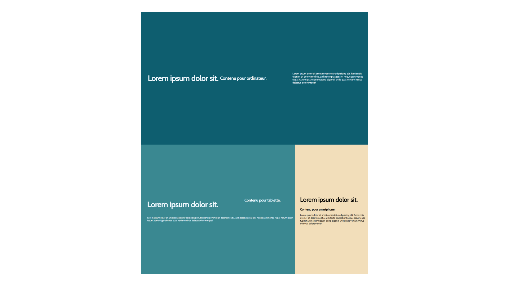

# responsiveness

In this repository, I experimented with responsive.
I created a simple page in HTML and CSS that adapts and changes its design according to the size of the screen used. Flexboxes were also used for this exercise.

---

Project completed

This repository was created and edited on November 18, 2022. This project is an exercise realized during the training web developer junior given by Becode.org

---

## Language

- HTML
- CSS

---

## How to install the repository locally

1. create a local working folder
2. open Git Bash
3. clone the repository
4. now you can work on the file

---

[Link to my Github Page](https://mathildecornelis.github.io/responsiveness/)
